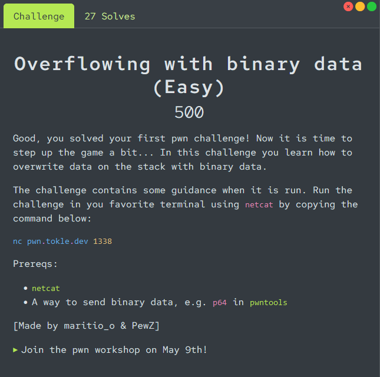

# Overflowing with binary data

<p align="center">

</p>

Connecting to the remote instance we are given the relevant [source code](./utils/program.c) for this challenge.

We also get the goal of the challenge, and a menu with some options.
```
Your goal is to overwrite data.size with: 0x00001337
Currently it contains: 0x00000123
Use the "Trigger bug" menu option to check data.size

Google these terms for help:
- pwntools
- pwntools packing p64
- endianness

Check out the pwntools cheat sheet at https://pwn101.tokle.dev

Good luck!

1. Fill buffer
2. Print stack frame
3. Trigger bug
4. Challenge description
5. [Quit]
```

In the `My First Overflow` we overwrote the `path` entry in the `file_data` struct, but in this challenge we need to overwrite the `size` entry. Because we have to send bytes, we can't just write a lot of A's and 0x1337 as the input (similar to the previous challenge). Instead, we need to write the bytes of the integer `0x1337` into the buffer. This is easier to do with a python script with pwntools.

The `size` entry is a 32-bit integer, so we need to write 4 bytes of data to overwrite it. We can use the `p32` function from `pwntools` to pack the integer `0x1337` into 4 bytes, and then write this data into the buffer.

A commented exploit script can be found in [solve.py](./solve.py).

```console
$ python3 solve.py
[+] Opening connection to pwn.tokle.dev on port 1338: Done
[*] Switching to interactive mode
You got it! Here's the flag: flag{binary_schminary}
```